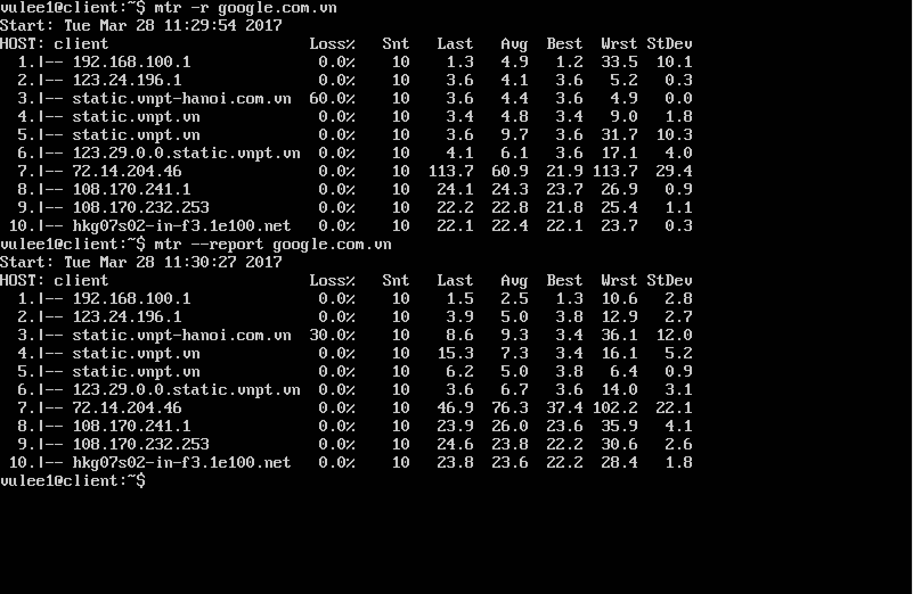
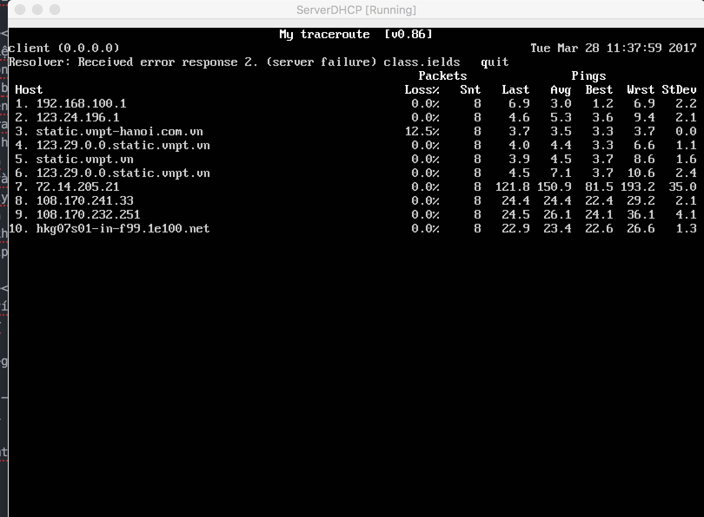
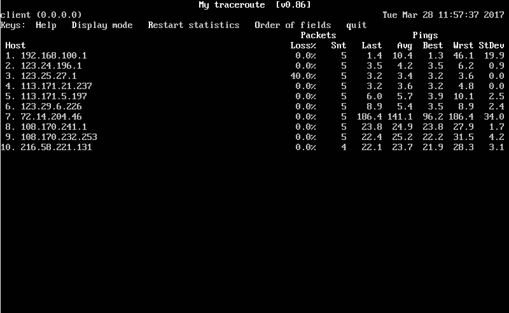

#Báo cáo về lệnh MTR (My Trace Router)

##Mục lục
-[1.Giới thiệu](#1)
-[2.Một số tuỳ chọn của lệnh mtr](#2)
-[3.Ý nghĩa của MTR Report](#3)

<a name='1'></a>
##1.Giới thiệu
-Mtr là 1 công cụ chuẩn đoán mạng mạnh mẽ, cho phép các quản trị viên chuẩn đoán và cô lập các lỗi mạng và cung cấp báo cáo
hữu ích về tình trạng mạng
-Mtr đại diện cho sự phát triển của lệnh tracerouter bằng cung cấp 1 mẫu dữ liệu lớn hơn, có nghĩa là tăng lệnh traceroute với đầu ra
là ping (sự kết hợp giữa traceroute và ping)
-Nguyên tắc hoạt động của lệnh mtr: Gửi gói ti ICMP với các TTL gia tằng từng bước để xem tuyến đừng hoặc hàng loạt bước nhảy mà gói tin thực hiện
giữa nguồn và đích của nó. Các TTL kiểm soát bao nhiêu "hop" một gói tin sẽ làm trước khi "chết" và trở về máy chủ. Bằng cách gửi một loạt gói tin và
cho chúng "chết" và trở lại sau 1 lần nhảy, sau đó 2,3 lần máy khách có thể lắp ráp các tuyêns đường mà lưu lượng giữa các máy chủ trên mạng.
-Thay vi đưa ra 1 bản phác thảo đơn giản về tuyêns đường như lệnh traceroute thì mtr sẽ thu thập thông tin bổ sung về trạng thái, kết nối và khả năng phản hồi
của các máy chủ trung gian.
-Mtr cung cấp tổng quan đầy đủ nhát về kết nối giữa 2 máy chủ trên internet
-Cài đặt mtr trên ubuntu-server:
   ```
   sudo apt-get install mtr
   ```

<a name='2'></a>
##Một số tuỳ chọn của mệnh mtr
-Tuỳ chọn: -r (--report): Tùy chọn này đặt mtr vào chế độ báo cáo. Khi ở chế độ này, mtr sẽ chạy với số chu kỳ được chỉ định bởi tùy chọn -c, sau đó in số liệu thống kê và thoát.
   ```
   mtr -r google.com.vn
   ```
   

-Tuỳ chọn: -c COUNT (--report-cycles COUNT): Tùy chọn này để thiết lập số lượng Ping gửi đi để xác định cả hai máy trên mạng và độ tin cậy của những máy đó. Mỗi chu kỳ kéo dài một giây.
   ```
   mtr -c 8 google.com.vn
   ```
   

-Tuỳ chọn: -n (--no-dns): Tùy chọn này để buộc mtr hiển thị các số IP số và không cố gắng giải quyết tên máy chủ lưu trữ.
   ```
   mtr -n google.com.vn
   ```
   

-Tuỳ chọn: -l (--raw):Sử dụng tùy chọn này để cho mtr sử dụng định dạng xuất thô. Định dạng này phù hợp hơn để lưu trữ kết quả đo.
Nó có thể được phân tích cú pháp để được trình bày vào bất kỳ phương pháp hiển thị khác.
   ```
   mtr -l google.com.vn
   ```
   

<a name='3'></a>
##3.Ý nghĩa của MTR Report
root@localhost:~# mtr --report www.google.com
HOST: localhost                   Loss%   Snt   Last   Avg  Best  Wrst StDev
  1. 63.247.74.43                  0.0%    10    0.3   0.6   0.3   1.2   0.3
  2. 63.247.64.157                 0.0%    10    0.4   1.0   0.4   6.1   1.8
  3. 209.51.130.213                0.0%    10    0.8   2.7   0.8  19.0   5.7
  4. aix.pr1.atl.google.com        0.0%    10  388.0 360.4 342.1 396.7   0.2
  5. 72.14.233.56                  0.0%    10  390.6 360.4 342.1 396.7   0.2
  6. 209.85.254.247                0.0%    10  391.6 360.4 342.1 396.7   0.4
  7. 64.233.174.46                 0.0%    10  391.8 360.4 342.1 396.7   2.1
  8. gw-in-f147.1e100.net          0.0%    10  392.0 360.4 342.1 396.7   1.2

-Loss%: Hiện thị số % số gói tin bị mất ở mỗi bước nhảy
-Snt: Hiện thị số lượng gói tin đang được gửi đi
-Last: Độ trễ của gói tin cuối được gửi
-Avg: Độ trễ trung bình của tất cả gói tin
-Best: Hiển thị thời gian quay vòng tốt nhất cho gói tin đến máy chủ lưu trữ này (RTT ngắn nhất).
-Wrst: Hiển thị thời gian quay vòng vòng tồi tệ nhất cho một gói tin đến máy chủ lưu trữ này (RTT dài nhất)
-StDev: Hiển thị độ lệch tiêu chuẩn của độ trễ cho mỗi máy chủ.

-Tham khảo: https://www.linode.com/docs/networking/diagnostics/diagnosing-network-issues-with-mtr
